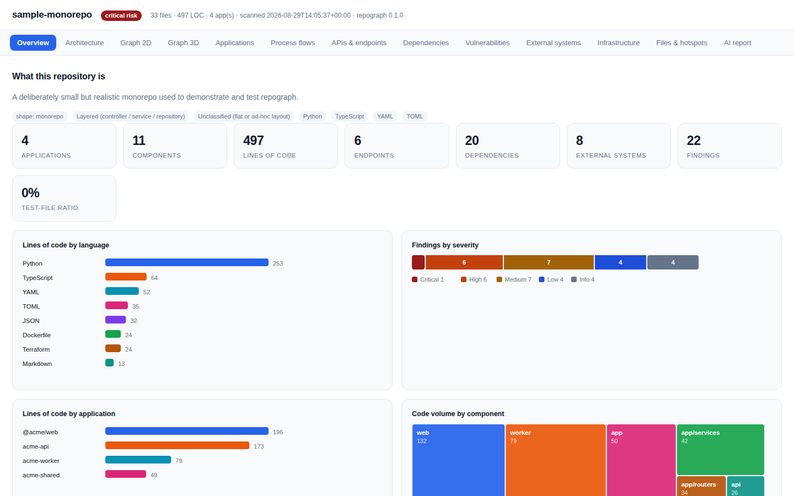
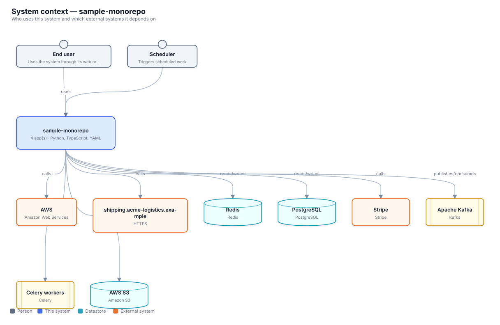
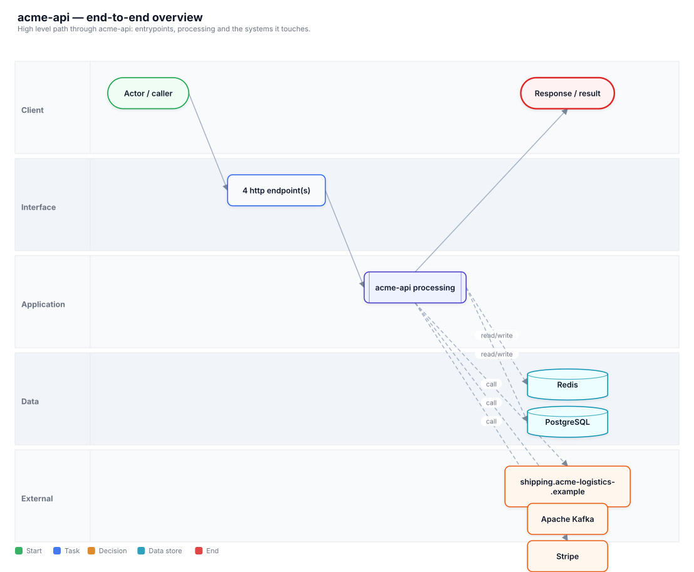
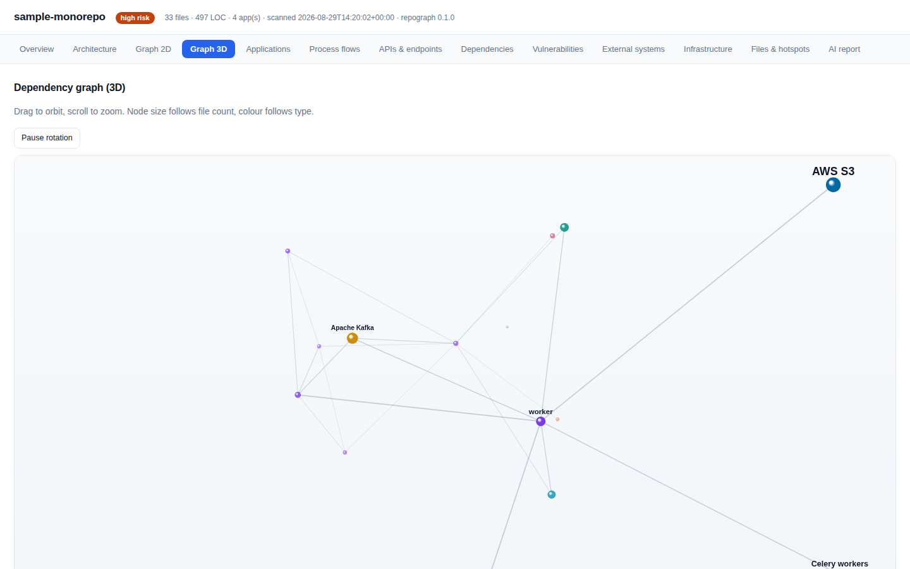
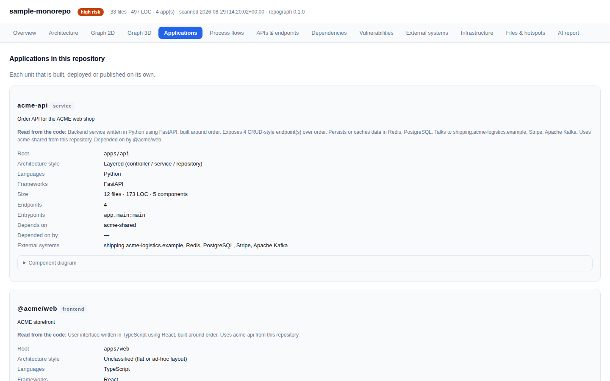
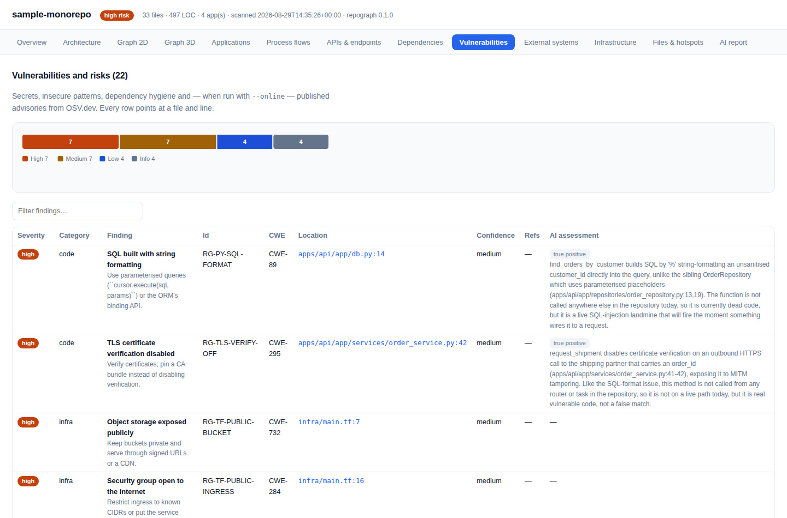

# repograph

**Point it at a repository. Get the architecture back.**

repograph is a single command that reads a codebase and produces the documentation nobody has time
to write: architecture diagrams (C4, ArchiMate, BPMN, flowcharts, Mermaid), a dependency graph you
can explore in 2D and 3D, an inventory of every API, database, queue and third-party system the
code touches, a vulnerability report, an SBOM, and a full set of exports — HTML, PDF, PowerPoint,
Excel, CSV and JSON.

It is **deterministic**: no AI, no network (unless you ask for advisory data), no code execution.
Every claim it makes points at the file and line it came from.

```bash
./bin/repograph scan /path/to/repo
```



---

## Why

Documentation rots. READMEs lie. The only thing that reliably describes a system is its code — but
reading a codebase to answer "what is this, what does it talk to, and where is the risk?" takes days.

repograph answers those questions in seconds, in a form both humans and AI agents can consume:

- **for humans** — an interactive HTML report, a printable PDF, a slide deck for the architecture
  review, and spreadsheets for the security backlog;
- **for agents** — `AI-REPORT.md`, a dense structured document that gives a model the full picture
  of a repository *without* it having to read the code.

## Install

repograph needs **Python 3.9+** and nothing else. It runs on macOS and Linux.

```bash
git clone https://github.com/WindyBanana/repograph
cd repograph

# option 1 — no install at all
./bin/repograph scan /path/to/repo

# option 2 — put it on your PATH
./scripts/install.sh          # uses pipx if available, otherwise symlinks into ~/.local/bin
repograph scan /path/to/repo
```

There are **no required third-party dependencies**. XLSX, PPTX, PDF, SVG and the interactive
report are all written from scratch, so a bare interpreter is enough.

## Use

```bash
repograph scan .                       # scan the current repository → ./repograph-out
repograph scan ~/code/app -o ./out     # choose the output folder
repograph scan . --online              # also check dependencies against OSV.dev
repograph scan . --format html,pdf     # only the formats you want
repograph scan . --open                # open the HTML report when it finishes
repograph tui                          # browse the results in the terminal
repograph serve ./repograph-out        # serve the report over http
repograph summary ./repograph-out      # print the headline numbers again
repograph render ./repograph-out/repograph.json   # re-render without re-scanning
```

Everything lands in **one folder** so you can hand it to a person, a pipeline or an agent:

```
repograph-out/
├── index.html            interactive report: 2D + 3D graphs, all diagrams, sortable tables
├── AI-REPORT.md          the agent-readable version of the same analysis
├── report.pdf            printable report with vector diagrams
├── presentation.pptx     slide deck — diagrams are editable shapes, not images
├── report.xlsx           workbook: findings, dependencies, endpoints, systems, components…
├── report.md             Markdown with embedded Mermaid (renders on GitHub)
├── repograph.json        the complete model, for anything you want to build on top
├── sbom.cdx.json         CycloneDX 1.5 software bill of materials
├── sbom.spdx.json        SPDX 2.3 software bill of materials
├── MANIFEST.json         what was written, plus headline numbers
├── data/*.csv            one CSV per entity
├── diagrams/*.svg        rendered diagrams
├── diagrams/mermaid/     Mermaid sources
├── diagrams/plantuml/    C4-PlantUML and ArchiMate sources
├── diagrams/dot/         Graphviz sources
├── diagrams/bpmn/        BPMN 2.0 with layout — opens in bpmn.io or Camunda
└── models/archimate.xml  ArchiMate 3.1 Open Exchange — imports into Archi
```

## What you get

### Architecture, drawn from the code

C4 context, container and component views, an application landscape, dependency layers, a
deployment view and an external systems map — all laid out by repograph itself, so the same
diagram appears in the HTML report, the PDF and the deck.



### Process flows with swimlanes

Every entrypoint (HTTP route, GraphQL operation, queue consumer, scheduled job, CLI command) is
followed through the import graph. Files are sorted into architectural lanes, guard clauses in the
handler become decision diamonds, and the data stores each path touches are attached — a BPMN-style
process, not a call tree.



### A dependency graph you can explore

Force-directed 2D and orbiting 3D views of every component and external system, with filtering,
search and neighbourhood isolation. Both are plain canvas — no libraries, no CDN, works offline
from `file://`.



### Read from the code, not from the README

A README goes stale; the code cannot. Every application gets a purpose derived from its own
routes, entity names, data stores and integrations — reported next to whatever the README claims,
so you can see when the two disagree.



### Everything else

| Area | What repograph reports |
|---|---|
| **Applications** | Each unit that is built or deployed separately, its kind (service, frontend, job, library, CLI), languages, frameworks, entrypoints and architecture style |
| **Dependencies** | Declared vs. resolved vs. actually imported, per ecosystem, including **missing declarations** and packages that are declared but never used |
| **APIs** | HTTP, GraphQL, gRPC, WebSocket, events, cron and CLI entrypoints with method, path, handler, framework and source location |
| **External systems** | Databases, caches, queues, storage, identity, payments, mail, observability and AI providers — with the file and line that proves each one |
| **Infrastructure** | Dockerfiles, Compose services, Kubernetes objects, Terraform resources, Helm charts, serverless functions and CI pipelines |
| **Security** | Hardcoded secrets, insecure code patterns (mapped to CWE), container and IaC misconfiguration, dependency hygiene, and OSV advisories with `--online` |
| **Quality** | Dependency cycles, layering, fan-in/fan-out, PageRank, test ratio, git change hotspots |

## Optional: an AI second opinion

The scan needs no model. If you want the part a scanner cannot do — intent, business meaning, a
judgement on each finding — hand the output to whichever coding agent you already use:

```bash
repograph scan .
repograph agent repograph-out          # prints the exact command for Claude Code, Codex, Gemini…
repograph enrich repograph-out         # validate, merge, re-render with contributions labelled
```

**Bring your own CLI, not your own key.** There is nothing to host, no key to store and no bill on
our side: the agent you already pay for reads `AGENT-INSTRUCTIONS.md`, answers a generated list of
open questions (each pointing at the few files worth opening), and writes a typed
`agent/enrichment.json`. repograph validates every answer — ids must exist, risks must cite
`path:line` — and reports whatever it rejects. Model contributions appear in every report clearly
labelled, never mixed with the scan's facts.

Run against the bundled example, an agent confirmed 5 findings and overturned 3 with cited
reasoning — MD5 used for a non-security purpose, a `0.0.0.0` bind that only ever runs inside a
container, and dead Dockerfile configuration the app never reads:



Its answers are checked in at `examples/agent-enrichment.example.json`, and the test suite
re-merges them so the contract stays honest. See [docs/AI.md](docs/AI.md).

## Monorepos

repograph is built for them. It detects npm/pnpm/Yarn workspaces, Cargo workspaces, Go modules,
Maven modules, .NET solutions and `apps/*`-style conventions, keeps each application separate, and
then shows how they interact — including shared libraries used across several apps.

Try it on the bundled example:

```bash
make demo    # scans examples/sample-monorepo
```

## Languages and ecosystems

| | |
|---|---|
| **Analysed for imports, symbols and endpoints** | Python, JavaScript, TypeScript, Vue, Svelte, Go, Java, Kotlin, Scala, Groovy, C#, Ruby, PHP, Rust, Elixir, Swift, Dart, C, C++, Objective-C, Shell, SQL, Protobuf, GraphQL |
| **Manifests** | package.json, pyproject.toml, requirements*.txt, Pipfile, setup.py, go.mod/go.work, pom.xml, build.gradle(.kts), *.csproj/*.sln, Cargo.toml, Gemfile, composer.json, pubspec.yaml, mix.exs |
| **Lockfiles** | package-lock.json, yarn.lock, pnpm-lock.yaml, poetry.lock, Cargo.lock, Gemfile.lock, composer.lock, go.sum, packages.lock.json, pubspec.lock |
| **Frameworks recognised** | FastAPI, Flask, Django, Celery, Express, NestJS, Next.js, SvelteKit, React, Vue, Angular, Spring, JAX-RS, ASP.NET Core, Gin, Echo, Chi, Actix, Axum, Rails, Sinatra, Laravel, Symfony, Phoenix, tRPC, GraphQL, gRPC and more |

See [docs/DETECTION.md](docs/DETECTION.md) for the full detection surface and rule list.

## Terminal UI

```bash
repograph tui              # scans if there is no previous result, then opens the browser
```

Ten views (overview, applications, components, endpoints, dependencies, findings, external
systems, flows, infrastructure, files), `/` to filter, arrow keys or `hjkl` to move, `d` to toggle
the detail pane, `?` for help.

## Using it with an AI agent

`AI-REPORT.md` is written for a model: fixed section order, explicit counts, `path:line` on every
claim, and an explicit **"limits of this analysis"** section so an agent knows what the scan could
*not* determine. A typical use:

> Read `repograph-out/AI-REPORT.md` and tell me where authentication is enforced, which services
> would break if PostgreSQL went down, and what you would fix first.

The agent gets the whole architecture without reading a single source file.

## Options

```
repograph scan [path]
  -o, --output DIR        output folder (default: <repo>/repograph-out)
  --online                query OSV.dev for dependency advisories
  --format LIST           all, html, json, markdown, ai, svg, mermaid, plantuml, dot,
                          bpmn, archimate, csv, xlsx, pptx, pdf, sbom
  --ignore GLOB           extra ignore pattern (repeatable)
  --no-tests              exclude test files
  --no-git                skip git history analysis
  --no-gitignore          do not honour .gitignore
  --max-file-size BYTES   skip files larger than this (default 2 MB)
  --max-flows N           maximum process flows to render (default 14)
  --open                  open the HTML report when finished
  --json                  print the summary as JSON
  -q, --quiet             only print errors
```

## How it works

1. **Walk** — discover files, honouring `.gitignore` and skipping vendored and generated code.
2. **Parse** — manifests and lockfiles for dependencies; per-language analysis for imports,
   symbols, routes and frameworks; config, IaC and CI files for infrastructure.
3. **Group** — find the applications (workspaces, modules, conventions) and split each into
   components sized for a readable diagram.
4. **Resolve** — turn every import into an internal file or an external package, which produces the
   dependency graph and the declared/used reconciliation.
5. **Detect** — match code and configuration against a signature table of external systems, and
   against secret, insecure-pattern and misconfiguration rules.
6. **Model** — build C4, ArchiMate, process flows, layers, cycles and rankings from the graph.
7. **Render** — lay out each diagram once, then emit SVG, PDF, PPTX, HTML, Mermaid, PlantUML, DOT,
   BPMN, XLSX, CSV and JSON from the same layout.

More detail in [docs/ARCHITECTURE.md](docs/ARCHITECTURE.md).

## Repository layout

```
packages/repograph-core/     scanning, analysis and the data model
packages/repograph-render/   layout, diagrams, documents and reports
packages/repograph-cli/      the command line interface
packages/repograph-tui/      the terminal UI
bin/repograph                zero-install launcher
examples/sample-monorepo/    a realistic monorepo used for the demo and the tests
```

## Development

```bash
make test      # unit + end-to-end tests (stdlib unittest, no dependencies)
make lint      # ruff, if installed
make demo      # scan the bundled example monorepo
make scan TARGET=/path/to/repo
```

## Limits — read these

- Import resolution is exact for Python, JavaScript/TypeScript, Go and JVM package layouts, and
  heuristic elsewhere. Unresolved imports are counted and reported rather than hidden.
- Dynamic behaviour (reflection, DI containers, runtime plugin loading, string-built SQL or URLs)
  is not traced. Flows show the intended path, not every runtime path.
- A detected external system proves a *reference in the code*, not production use. Every detection
  carries its evidence.
- Without `--online`, published CVEs for dependencies are **not** checked; the report says so.

## Roadmap

Multi-repository scanning and cross-repo landscape views, a rules file for project-specific
conventions, incremental scans, and more language analyzers. See
[docs/ROADMAP.md](docs/ROADMAP.md).

## License

MIT — see [LICENSE](LICENSE).
